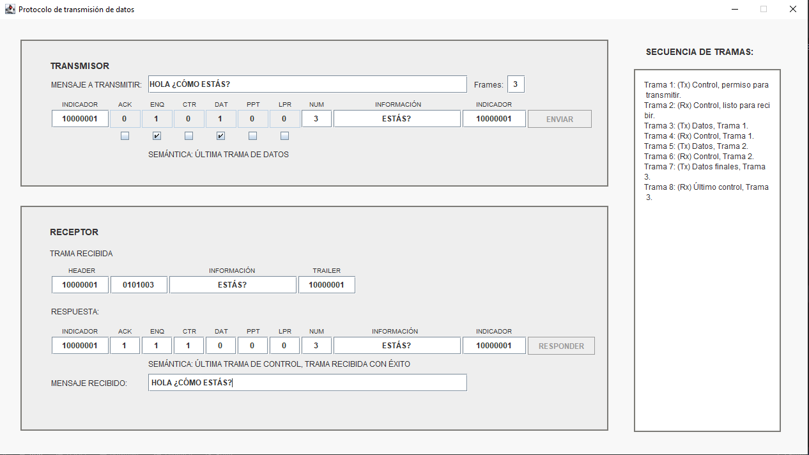

# Simulador de protocolo
📚 Una simulación de protocolo que permite la interacción de mensajes de control y de datos de acuerdo a unas reglas establecidas para la comunicación. (Asignatura: Redes de Comunicaciones I).

</img>

## Notas para el correcto funcionamiento
- El primer ajuste del transmisor es manual (activar **PPT** y **CTR**, también colocar el **mensaje a transmitir** y el No. de **frames**).
- Cada vez que el **transmisor** envíe una trama, se deberá enviar la respuesta del receptor manualmente antes de enviar otra trama (basta con oprimir el botón **responder**).
- El **receptor** sólo debe responder 1 vez manualmente por cada trama enviada por el **transmisor**. (para evitar mensajes duplicados en la secuencia de tramas)
- Los valores de **respuesta** se colocan automáticamente al recibir una trama, no es necesario modificarlo. (podría cambiar el mensaje que le envía al sistema).
- El **mensaje a transmitir** y **Frames** se escriben antes de presionar el botón **enviar** por primera vez, no deben estar vacíos, escribir datos válidos.
- Para que funcione automáticamente sin problemas, no editar tramas (se pueden modificar las tramas, aunque podría generar alguna excepción causada por interrumpir el flujo automático).
- Para usar evitar las excepciones por interrupción del flujo automático, no llenar el campo de **mensaje a transmitir** desde el inicio de la ejecución. (de esta forma se puede continuar de forma manual naturalmente e indefinidamente).

## Más información acerca del proyecto

[Requerimientos.](pdf/protocolo.pdf)
